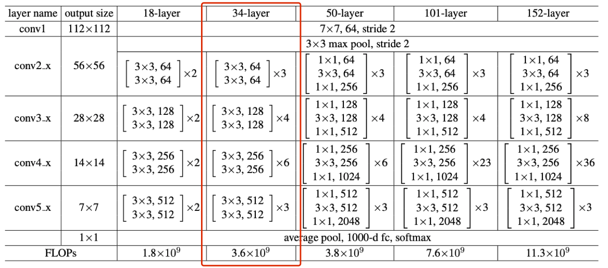

# Face Verification Using Convolutional Neural Networks
- Task description: Design an end-to-end system for face verification with Convolutional Neural Networks (CNNs). Your system will be given two images as input and will output a score that quantifies the similarity between the faces in these images. This helps us decide whether the faces from the two images are of the same person or not.
- Evaluation: The Receiver Operating Characteristic (ROC) curve is created by plotting the True Positive Rate (TPR) against the False Positive Rate (FPR) at various threshold settings. The Area Under the Curve (AUC) for the ROC curve is equal to the probability that a classifier will rank a randomly chosen similar pair (images of same people) higher than a randomly chosen dissimilar one (images from two different people) (assuming 'similar' ranks higher than 'dissimilar' in terms of similarity scores).
- [Kaggle competition link](https://www.kaggle.com/c/11-785-fall-20-homework-2-part-2).

## Performance

- Epoch for the best result = 68.
- Ranking top 3% (5 out of 233) [[Kaggle leaderboard]](https://www.kaggle.com/c/11-785-fall-20-homework-2-part-2/leaderboard).
- Classification task:
    - training accuracy = 100%, loss = 0.0047.
    - validation accuracy = 89.74%, loss = 0.4977.
- Verification task:
    - validation AUC = 0.9712.
    - testing AUC = 0.9716 (at Kaggle).

## Architecture

- Implement a ResNet-34 from scratch based on its original [paper](https://arxiv.org/abs/1512.03385).
- 
- For detailed description please refer to Figure 3 in the paper.

## Data
- Data available upon request.

## Training design
- Data augmentation: horizontally flip the given image randomly with a probability of 0.5 (transforms.RandomHorizontalFlip()) - increase the AUC for 3% after added.
- Objective function for classification: Cross entropy loss
- Optimizer: SGD(momentum=0.9, weight decay=5e-5, initial learning rate=0.15)
- Learning rate scheduler on validation loss: ReduceLROnPlateau with mode="min", patience=2, factor=0.85.
- Batch size=128.

## How to run?
- Run the file `script.ipynb`.

## Detailed network structure: 
```
Resnet34(
  (conv1): Conv2d(3, 64, kernel_size=(3, 3), stride=(1, 1), padding=(1, 1), bias=False)
  (bn1): BatchNorm2d(64, eps=1e-05, momentum=0.1, affine=True, track_running_stats=True)
  (conv2): ConvBlock(
    (conv1): Conv2d(64, 64, kernel_size=(3, 3), stride=(1, 1), bias=False)
    (bn1): BatchNorm2d(64, eps=1e-05, momentum=0.1, affine=True, track_running_stats=True)
    (conv2): Conv2d(64, 64, kernel_size=(3, 3), stride=(1, 1), padding=(1, 1), bias=False)
    (bn2): BatchNorm2d(64, eps=1e-05, momentum=0.1, affine=True, track_running_stats=True)
    (conv3_sc): Conv2d(64, 64, kernel_size=(3, 3), stride=(1, 1), bias=False)
    (bn3_sc): BatchNorm2d(64, eps=1e-05, momentum=0.1, affine=True, track_running_stats=True)
  )
  (iden21): IdentityBlock(
    (conv1): Conv2d(64, 64, kernel_size=(3, 3), stride=(1, 1), bias=False)
    (bn1): BatchNorm2d(64, eps=1e-05, momentum=0.1, affine=True, track_running_stats=True)
    (conv2): Conv2d(64, 64, kernel_size=(1, 1), stride=(1, 1), padding=(1, 1), bias=False)
    (bn2): BatchNorm2d(64, eps=1e-05, momentum=0.1, affine=True, track_running_stats=True)
  )
  (iden22): IdentityBlock(
    (conv1): Conv2d(64, 64, kernel_size=(3, 3), stride=(1, 1), bias=False)
    (bn1): BatchNorm2d(64, eps=1e-05, momentum=0.1, affine=True, track_running_stats=True)
    (conv2): Conv2d(64, 64, kernel_size=(1, 1), stride=(1, 1), padding=(1, 1), bias=False)
    (bn2): BatchNorm2d(64, eps=1e-05, momentum=0.1, affine=True, track_running_stats=True)
  )
  (conv3): ConvBlock(
    (conv1): Conv2d(64, 128, kernel_size=(3, 3), stride=(1, 1), bias=False)
    (bn1): BatchNorm2d(128, eps=1e-05, momentum=0.1, affine=True, track_running_stats=True)
    (conv2): Conv2d(128, 128, kernel_size=(3, 3), stride=(2, 2), padding=(1, 1), bias=False)
    (bn2): BatchNorm2d(128, eps=1e-05, momentum=0.1, affine=True, track_running_stats=True)
    (conv3_sc): Conv2d(64, 128, kernel_size=(3, 3), stride=(2, 2), bias=False)
    (bn3_sc): BatchNorm2d(128, eps=1e-05, momentum=0.1, affine=True, track_running_stats=True)
  )
  (iden31): IdentityBlock(
    (conv1): Conv2d(128, 128, kernel_size=(3, 3), stride=(1, 1), bias=False)
    (bn1): BatchNorm2d(128, eps=1e-05, momentum=0.1, affine=True, track_running_stats=True)
    (conv2): Conv2d(128, 128, kernel_size=(1, 1), stride=(1, 1), padding=(1, 1), bias=False)
    (bn2): BatchNorm2d(128, eps=1e-05, momentum=0.1, affine=True, track_running_stats=True)
  )
  (iden32): IdentityBlock(
    (conv1): Conv2d(128, 128, kernel_size=(3, 3), stride=(1, 1), bias=False)
    (bn1): BatchNorm2d(128, eps=1e-05, momentum=0.1, affine=True, track_running_stats=True)
    (conv2): Conv2d(128, 128, kernel_size=(1, 1), stride=(1, 1), padding=(1, 1), bias=False)
    (bn2): BatchNorm2d(128, eps=1e-05, momentum=0.1, affine=True, track_running_stats=True)
  )
  (iden33): IdentityBlock(
    (conv1): Conv2d(128, 128, kernel_size=(3, 3), stride=(1, 1), bias=False)
    (bn1): BatchNorm2d(128, eps=1e-05, momentum=0.1, affine=True, track_running_stats=True)
    (conv2): Conv2d(128, 128, kernel_size=(1, 1), stride=(1, 1), padding=(1, 1), bias=False)
    (bn2): BatchNorm2d(128, eps=1e-05, momentum=0.1, affine=True, track_running_stats=True)
  )
  (conv4): ConvBlock(
    (conv1): Conv2d(128, 256, kernel_size=(3, 3), stride=(1, 1), bias=False)
    (bn1): BatchNorm2d(256, eps=1e-05, momentum=0.1, affine=True, track_running_stats=True)
    (conv2): Conv2d(256, 256, kernel_size=(3, 3), stride=(2, 2), padding=(1, 1), bias=False)
    (bn2): BatchNorm2d(256, eps=1e-05, momentum=0.1, affine=True, track_running_stats=True)
    (conv3_sc): Conv2d(128, 256, kernel_size=(3, 3), stride=(2, 2), bias=False)
    (bn3_sc): BatchNorm2d(256, eps=1e-05, momentum=0.1, affine=True, track_running_stats=True)
  )
  (iden41): IdentityBlock(
    (conv1): Conv2d(256, 256, kernel_size=(3, 3), stride=(1, 1), bias=False)
    (bn1): BatchNorm2d(256, eps=1e-05, momentum=0.1, affine=True, track_running_stats=True)
    (conv2): Conv2d(256, 256, kernel_size=(1, 1), stride=(1, 1), padding=(1, 1), bias=False)
    (bn2): BatchNorm2d(256, eps=1e-05, momentum=0.1, affine=True, track_running_stats=True)
  )
  (iden42): IdentityBlock(
    (conv1): Conv2d(256, 256, kernel_size=(3, 3), stride=(1, 1), bias=False)
    (bn1): BatchNorm2d(256, eps=1e-05, momentum=0.1, affine=True, track_running_stats=True)
    (conv2): Conv2d(256, 256, kernel_size=(1, 1), stride=(1, 1), padding=(1, 1), bias=False)
    (bn2): BatchNorm2d(256, eps=1e-05, momentum=0.1, affine=True, track_running_stats=True)
  )
  (iden43): IdentityBlock(
    (conv1): Conv2d(256, 256, kernel_size=(3, 3), stride=(1, 1), bias=False)
    (bn1): BatchNorm2d(256, eps=1e-05, momentum=0.1, affine=True, track_running_stats=True)
    (conv2): Conv2d(256, 256, kernel_size=(1, 1), stride=(1, 1), padding=(1, 1), bias=False)
    (bn2): BatchNorm2d(256, eps=1e-05, momentum=0.1, affine=True, track_running_stats=True)
  )
  (iden44): IdentityBlock(
    (conv1): Conv2d(256, 256, kernel_size=(3, 3), stride=(1, 1), bias=False)
    (bn1): BatchNorm2d(256, eps=1e-05, momentum=0.1, affine=True, track_running_stats=True)
    (conv2): Conv2d(256, 256, kernel_size=(1, 1), stride=(1, 1), padding=(1, 1), bias=False)
    (bn2): BatchNorm2d(256, eps=1e-05, momentum=0.1, affine=True, track_running_stats=True)
  )
  (iden45): IdentityBlock(
    (conv1): Conv2d(256, 256, kernel_size=(3, 3), stride=(1, 1), bias=False)
    (bn1): BatchNorm2d(256, eps=1e-05, momentum=0.1, affine=True, track_running_stats=True)
    (conv2): Conv2d(256, 256, kernel_size=(1, 1), stride=(1, 1), padding=(1, 1), bias=False)
    (bn2): BatchNorm2d(256, eps=1e-05, momentum=0.1, affine=True, track_running_stats=True)
  )
  (conv5): ConvBlock(
    (conv1): Conv2d(256, 512, kernel_size=(3, 3), stride=(1, 1), bias=False)
    (bn1): BatchNorm2d(512, eps=1e-05, momentum=0.1, affine=True, track_running_stats=True)
    (conv2): Conv2d(512, 512, kernel_size=(3, 3), stride=(2, 2), padding=(1, 1), bias=False)
    (bn2): BatchNorm2d(512, eps=1e-05, momentum=0.1, affine=True, track_running_stats=True)
    (conv3_sc): Conv2d(256, 512, kernel_size=(3, 3), stride=(2, 2), bias=False)
    (bn3_sc): BatchNorm2d(512, eps=1e-05, momentum=0.1, affine=True, track_running_stats=True)
  )
  (iden51): IdentityBlock(
    (conv1): Conv2d(512, 512, kernel_size=(3, 3), stride=(1, 1), bias=False)
    (bn1): BatchNorm2d(512, eps=1e-05, momentum=0.1, affine=True, track_running_stats=True)
    (conv2): Conv2d(512, 512, kernel_size=(1, 1), stride=(1, 1), padding=(1, 1), bias=False)
    (bn2): BatchNorm2d(512, eps=1e-05, momentum=0.1, affine=True, track_running_stats=True)
  )
  (iden52): IdentityBlock(
    (conv1): Conv2d(512, 512, kernel_size=(3, 3), stride=(1, 1), bias=False)
    (bn1): BatchNorm2d(512, eps=1e-05, momentum=0.1, affine=True, track_running_stats=True)
    (conv2): Conv2d(512, 512, kernel_size=(1, 1), stride=(1, 1), padding=(1, 1), bias=False)
    (bn2): BatchNorm2d(512, eps=1e-05, momentum=0.1, affine=True, track_running_stats=True)
  )
  (avgpool): AdaptiveAvgPool2d(output_size=(1, 1))
  (fc): Linear(in_features=512, out_features=4000, bias=False)
)
```


## Reference
He, K., Zhang, X., Ren, S., & Sun, J. (2016). Deep residual learning for image recognition. In Proceedings of the IEEE conference on computer vision and pattern recognition (pp. 770-778).
